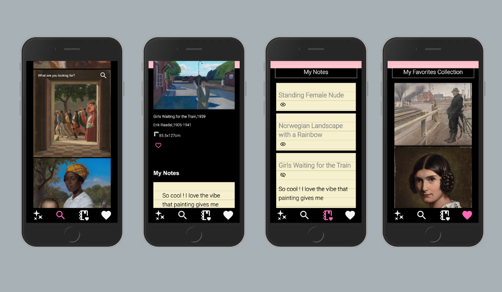

# SMK Notes

## Capstone Project of the Web Development bootcamp at neuefische

'SMK Notes' utilizes the API of the National Gallery of Denmark (SMK). The app enables visitors to take notes on artworks during or before/after their museum visit, creating a digital notebook for a lasting museum experience.

### Deployment

Check out the [latest version](https://smk-notes.vercel.app) of SMK Notes on Vercel

### Tech Stack

- React
- Next.js
- Styled Components
- React Testing Library
- Jest
- SMK API
- useSWR

### Project Setup

- Clone this repository
- Install all dependencies using `npm install`
- Run app in development mode using `npm run dev`, and open [http://localhost:3000/](http://localhost:3000/)
